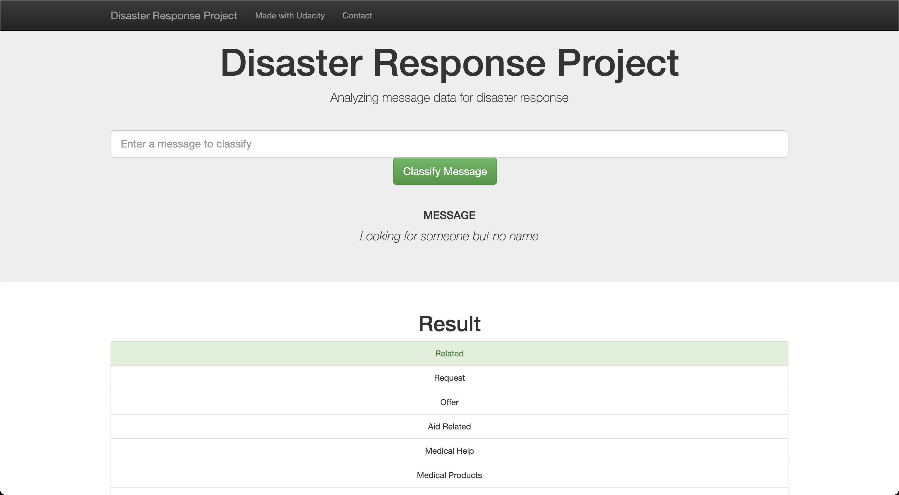

# Disaster Response Pipeline Project

## Table of Contents

1. [Description](#description)
2. [Getting Started](#getting_started)
   1. [Dependencies](#dependencies)
   2. [Files Structures](#files_structures)
   3. [Installation](#installation)
   4. [Executing Program](#execution)
   5. [Additional Material](#material)
3. [Authors](#authors)
4. [License](#license)
5. [Acknowledgement](#acknowledgement)
6. [Screenshots](#screenshots)

## Description

This Project is from Data Science Nanodegree Program by Udacity. It is contains the pre-labelled messages from disaster events. The Project is building a Natural Language Processing (NLP) pipeline to categorize messages.

This project contains the following parts:

1. Processing data, building an ETL pipeline to extract data from csv files, clean the data and save them in Database.
2. Build a pipeline to train the and classify text message to categories
3. Run a web app which can show model results in real time

## Getting Started

### Dependencies

- Python 3.7+
- Machine Learning Libraries: NumPy, Pandas, Sciki-Learn
- Natural Language Process Libraries: NLTK
- SQLlite Database Libraqries: SQLalchemy
- Model Loading and Saving Library: Pickle
- Web App and Data Visualization: Flask, Plotly

### Files Structures

- [data](./data): Contains the data and processing code
- [images](./images): Contains the images needed for the repository
- [models](./models): Contains the models
- [templates](./templates): Contains the templates for web UI
- [run.py](./run.py): To run the web
- [README.md](./README.md)

### Installation

- Install Python 3.9 from website
- Install required dependencies:
`pip install numpy pandas sklearn nltk pickle ploty SQLalchemy flask`

### Executing Program:

1. Run the following commands in the project's root directory to set up your database and model.

   - To run ETL pipeline that cleans data and stores in database
     `python data/process_data.py data/disaster_messages.csv data/disaster_categories.csv data/Database.db`
   - To run ML pipeline that trains classifier and saves
     `python models/train_classifier.py data/Database.db models/model.sav`

2. Run your web app: `python run.py`

3. Open browser and go to `http://localhost:3000/`

### Additional Material

In the **data** and **models** folder there are two jupyter notebooks describe how the model works:
1. **ETL Preparation Notebook**: read, join and transform data
2. **ML Pipeline Preparation Notebook**: define and build model

## Authors
[anhtu12st](https://github.com/anhtu12st)

## License

## Acknowledgements

* [Udacity](https://www.udacity.com/) provides course for Data Scientists
* [Figure Eight](https://www.figure-eight.com/) provides the relevant dataset
